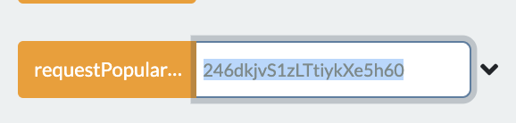

### Spotify Adadpter

# For Contract Developers wanting to use the adapter

This job is currently hosted on node `0xB36d3709e22F7c708348E225b20b13eA546E6D9c` with job ID `903c5a53e95141218e2784a6142f53a5`

Please check out sample.sol for some sample use of getting data from the adapter.

Follow the instructions from: https://docs.chain.link/docs/example-walkthrough, but instead of using `ATestNetConsumer.sol` use `sample.sol` from this repo. And in `requestPopularity` enter the artist ID. 



### For external adapter developers and node operators

**Adapter Formats**: Google Cloud Function, AWS Lambda and Docker

**All Endpoints (functions) supported** 

## Cloud Installation:
Make the bash script executable

```chmod +x ./create_zip.bsh```

Create the adapter zip for your cloud provider ( gcs or aws )

```./create_zip.bsh aws```

Upload the created zip to your provider and set the appropriate handler ( gcs_handler or aws_handler ) to be triggered by a HTTP event.

Function to execute: "gcs_handler"

You'll need two environment variables:
`SPOTIFY_CLIENT_ID`
`SPOTIFY_CLIENT_SECRET`

You can get them from the [spotify developers page](https://developer.spotify.com/)


## Docker Installation:
Build the image
```
docker build -t spotify_cl_ea .
```
Run the container while passing in your SPOTIFY_CLIENT_ID and SPOTIFY_CLIENT_SECRET
```
docker run -e SPOTIFY_CLIENT_ID=************** -e SPOTIFY_CLIENT_SECRET=************* -p 5000:5000 spotify_cl_ea
```
The adapter endpoint will be accessable from ```http://localhost/:5000/spotify_cl_ea```

## Sample call:
```
curl -X POST "https://us-central1-chainlink-256615.cloudfunctions.net/function-1" -H "Content-Type:application/json" --data '{"data": {"artist": "246dkjvS1zLTtiykXe5h60"}}'
```
Sample return:
```
{
  "external_urls": {
    "spotify": "https://open.spotify.com/artist/246dkjvS1zLTtiykXe5h60"
  },
  "followers": {
    "href": null,
    "total": 24543702
  },
  "genres": [
    "dfw rap",
    "melodic rap",
    "rap"
  ],
  "href": "https://api.spotify.com/v1/artists/246dkjvS1zLTtiykXe5h60",
  "id": "246dkjvS1zLTtiykXe5h60",
  "images": [
    {
      "height": 640,
      "url": "https://i.scdn.co/image/93fec27f9aac86526b9010e882037afbda4e3d5f",
      "width": 640
    },
    {
      "height": 320,
      "url": "https://i.scdn.co/image/9040899d5660920fdf7efeb7aa2cc4e6d86f86f6",
      "width": 320
    },
    {
      "height": 160,
      "url": "https://i.scdn.co/image/d15a5ffb3d22adabd09a749e09e846f527ab5a94",
      "width": 160
    }
  ],
  "name": "Post Malone",
  "popularity": 96,
  "type": "artist",
  "uri": "spotify:artist:246dkjvS1zLTtiykXe5h60"
}
```

## Sample Job Spec
```
{
  "initiators": [
    {
      "type": "runlog",
      "params": {
        "address": "0xb36d3709e22f7c708348e225b20b13ea546e6d9c"
      }
    }
  ],
  "tasks": [
    {
      "type": "spotify-adapter",
      "confirmations": null,
      "params": {
      }
    },
    {
      "type": "copy",
      "confirmations": null,
      "params": {
      }
    },
    {
      "type": "multiply",
      "confirmations": null,
      "params": {
      }
    },
    {
      "type": "ethuint256",
      "confirmations": null,
      "params": {
      }
    },
    {
      "type": "ethtx",
      "confirmations": null,
      "params": {
      }
    }
  ],
  "startAt": null,
  "endAt": null
}
```


## Testing
# Currently broken

To test just the URL creation run:
```python -m pytest -k test_url_creation```

Once you have ```test_config.json``` set up, you can run each appropriatly depending on your setup.

If you have a docker, aws, and gcp setup, feel free to run:
```python -m pytest```

```test_data.json``` contains example payloads for some supported endpoints, paths and their parameters.

